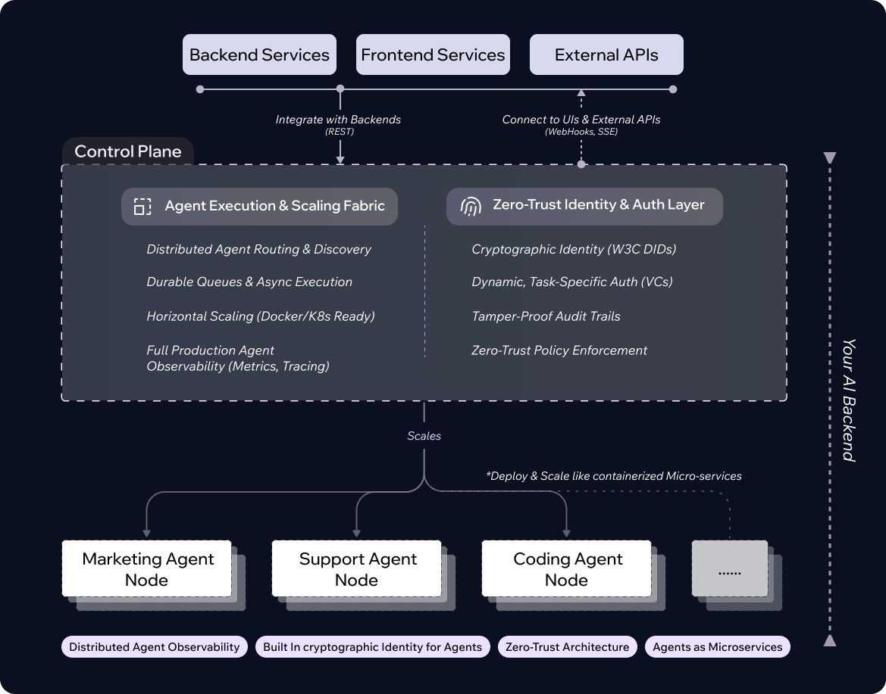

<div align="center">


> **👋 Welcome Early Adopter!**
>
> You've discovered AgentField before our official launch. We're currently in private beta, gathering feedback from early users to shape the future of the autonomous software. Feel free to explore and test, and we'd love to hear your thoughts! Share feedback via [GitHub Issues](https://github.com/Agent-Field/agentfield/issues) or email us at contact@agentfield.ai. Please note that features and APIs are still being refined before our public release.

### Kubernetes for AI Agents - **Deploy, Scale, Observe, and Prove**

Open-source (Apache-2.0) **control plane** that runs AI agents like microservices.
Every agent gets **REST/gRPC APIs**, **async execution & webhooks**, **built-in observability**, and **cryptographic identity & audit**.


[](LICENSE)
[](https://go.dev/)
[](https://www.python.org/)
[](https://docs.docker.com/)

**[📚 Docs](https://agentfield.ai/docs)** • **[⚡ Quickstart](#quickstart-in-60-seconds)** • **[🧠 Why AgentField](#why-agentfield)**

</div>

---

## 🚀 **Ship Production-Ready AI Agents in Minutes**

✅ **Write agents in Python/Go** (or any language via REST/gRPC)

✅ **Deploy independently** like microservices-zero coordination between teams

✅ **Get production infrastructure automatically**:
- **IAM & cryptographic audit trails** - W3C DIDs + Verifiable Credentials
- **REST APIs, streaming, async queues** - auto-generated endpoints
- **Built-in observability & metrics** - Prometheus + workflow DAGs

✅ **Run anywhere**: local dev, Docker, Kubernetes, cloud

```bash
curl -fsSL https://agentfield.ai/install.sh | bash && af init my-agents
```

**[📚 Full Docs](https://agentfield.ai/docs)** • **[⚡ Quick Start](https://agentfield.ai/docs/quick-start)** • **[🎯 Examples](https://github.com/agentfield/agentfield-examples)**

---

## 🚀 Try AgentField in 2 Minutes

### Option 1: Local Install

```bash
# macOS/Linux - install CLI
curl -fsSL https://agentfield.ai/install.sh | bash

# Start control plane + create your first agent
af init my-agents && cd my-agents
af run
```

### Option 2: Docker Compose

```bash
git clone https://github.com/agentfield/agentfield
cd agentfield && docker compose up
```

Your control plane is running at `http://localhost:8080`

<details>
<summary><code>export AGENT_CALLBACK_URL="http://host.docker.internal:8001"</code></summary>

**Heads-up:** When your agent nodes run outside the Docker network (local shell, another VM, etc.) they can't be reached through `localhost`. Before starting any agent, set a callback URL that the control plane can dial:

```bash
export AGENT_CALLBACK_URL="http://host.docker.internal:8001"
```

Replace `host.docker.internal` with whatever host/IP the control plane can reach if you're on Linux or a remote machine.

</details>

**[📚 Full quickstart guide →](https://agentfield.ai/docs/quick-start)**

```python
from agentfield import Agent

# Create an agent
app = Agent(node_id="greeting-agent",
            model="openrouter/meta-llama/llama-4-maverick")

# Decorate a function-becomes a REST endpoint automatically
@app.reasoner()
async def say_hello(name: str) -> dict:

    message = await app.ai(f"Generate a personalized greeting for {name}")

    return {"greeting": message}
```

**Deploy:**
```bash
export OPENROUTER_API_KEY="sk-..."
af run
```

**Call from anywhere** (REST API auto-generated):
```bash
curl -X POST http://localhost:8080/api/v1/execute/greeting-agent.say_hello \
  -H "Content-Type: application/json" \
  -d '{"input": {"name": "Alice"}}'
```

**You automatically get:**
- ✅ REST API at `/execute/greeting-agent.say_hello` (OpenAPI spec at `/openapi.yaml`)
- ✅ Async execution: `/execute/async/...` with webhook callbacks (HMAC-signed)
- ✅ Prometheus metrics: `/metrics`
- ✅ Workflow Observability


**[📚 Docs](https://agentfield.ai/docs)** • **[⚡ More examples](https://github.com/agentfield/agentfield-examples)**


## Why AgentField?

**TL;DR:** Most agent frameworks are built for prototypes. AgentField is infrastructure for production. If you've tried running multi-agent systems in production, you've hit these problems: agents deployed as a monolith (one team's change redeploys everyone), no proof of what your AI did for auditors, manual service discovery between agents, and building your own queues/webhooks/state management for long running AI nested calls. AgentField ships as a control plane + agent nodes architecture - like Kubernetes for autonomous software. Deploy agents independently, get cryptographic audit trails, and coordinate through zero-config shared memory. Every reasoner becomes a REST endpoint automatically.

### From Prototype to Production

| 🔴 Building Without AgentField                                                                                                                                                          | 💚 Building With AgentField                                                                                                                                                                                                          |
| -------------------------------------------------------------------------------------------------------------------------------------------------------------------------------------- | ----------------------------------------------------------------------------------------------------------------------------------------------------------------------------------------------------------------------------------- |
| **No cryptographic identity** - agents are names in logs; when regulators ask "prove this AI made this decision," you have editable logs with no tamper-proof record                   | **DIDs + Verifiable Credentials** - every agent gets a W3C DID; every execution produces a signed VC; export cryptographic proof chains that auditors verify offline with `af verify audit.json`                                    |
| **Monolithic deployments** - all agents in one codebase; Marketing team's update redeploys Support team's agents; coordination nightmare across teams                                  | **Control plane coordinates independent agents** - each team deploys their agent on their own schedule; discovery/routing/orchestration handled by stateless control plane; zero coordination needed                                |
| **Lost context across agent boundaries** - Agent A calls Agent B, you can't trace the full execution; no visibility into multi-agent workflows                                         | **Context propagation built-in** - `workflow_id`, `execution_id`, `session_id` flow automatically through headers; see complete DAG of which agent called which, when, why - distributed tracing without instrumentation            |
| **Manual state management** - set up Redis/database yourself; handle race conditions; write sync logic for agents to share data                                                        | **Zero-config shared memory fabric** - `await app.memory.set("key", val)` works across distributed agents; hierarchical scopes (workflow/session/actor/global); real-time change events via `@app.memory.on_change("key")`          |
| **DIY async infrastructure** - implement PostgreSQL queues with `FOR UPDATE SKIP LOCKED`, build webhook delivery with HMAC signing and retries, handle backpressure, graceful shutdown | **Durable execution ships working** - PostgreSQL-backed queues, automatic retries with exponential backoff, HMAC webhook delivery (GitHub-style), fair scheduling, Prometheus metrics, health checks for K8s - no assembly required |
| **Timeout hell for nested AI calls** - HTTP timeouts kill long-running reasoners; Agent A calls Agent B calls Agent C fails after 60s; build custom async queues and polling infrastructure | **Durable async execution** - reasoners run for hours/days without timeout; nested agent workflows (A→B→C) work natively; async endpoints + webhooks built-in; no external queue infrastructure needed |
| **Hardcoded integrations** - manually wire up service discovery; build custom REST wrappers for frontend teams; maintain API gateway; coordinate URLs across deployments               | **Auto-discovery + instant APIs** - call any agent via `await app.call("agent.function")`; every `@app.reasoner()` becomes `/api/v1/execute/agent.function` automatically; React/iOS/Android call via HTTP, no SDK needed           |


## 🎨 See It In Action

<div align="center">


<br/>

**Real-time Scaling/Observability • Execution traces • IAM • Verifiable Credentials**

*Everything you need to run production AI agents-built in, zero configuration*

</div>


## What You Get Out-of-the-Box

🧩 Scale Infrastructure - deploy like microservices
	•	Durable async execution for long-running & nested AI workflows (hours/days, no timeouts)
	•	Auto-generated queues, webhooks (HMAC-signed), event streaming
	•	Auto-discovery & cross-agent calls; context propagation
	•	Horizontal scaling & many more..!

🔐 Trust & Governance - cryptographic proof for every decision
	•	W3C IDs & Verifiable Credentials
	•	Tamper-proof audit trails; runtime policy enforcement
	•	Offline verification for auditors

🛰 Production Hardening - observability & reliability built in
	•	Auto-generated workflow DAGs
	•	Prometheus metrics, structured logs
	•	Graceful shutdowns, retries, zero-config memory

**Learn more:** [Features](https://agentfield.ai/docs/features) • [Identity & Trust](https://agentfield.ai/docs/why-agentfield/vs-agent-frameworks)

---

## 🏗️ Architecture

<div align="center">

</div>

---

| Layer         | What It Does                                                  |
| ------------- | ------------------------------------------------------------- |
| Control Plane | Stateless Go service; routes, observes, verifies, scales      |
| Agent Nodes   | Your independent agent microservices (Python/Go/REST/gRPC)    |
| Interfaces    | Backends via REST; frontends & external APIs via webhooks/SSE |

Each agent is a microservice. Teams deploy independently; the control plane makes them behave as one coherent system.

**More:** [Architecture](https://agentfield.ai/docs/architecture) • [API Reference](https://agentfield.ai/docs/api)


## Real-Time & Async

- **Unified API:** `POST /api/v1/execute/{agent.reasoner}`
- **Async runs:** `/execute/async/...` + signed webhooks
- **Live streams:** Server-Sent Events (SSE) for real-time output
- **Auto retries, backpressure, dead-letter queues**

**Docs:** [API Reference](https://agentfield.ai/docs/api) • [Observability](https://agentfield.ai/docs/observability)


## Identity & Audit (opt-in per agent)

- DIDs auto-issued for agents (`did:web` / `did:key`)
- Verifiable Credentials (W3C JSON-LD) for each execution
- Input/output hashing for proof integrity
- Offline verification for auditors (`af vc verify audit.json`)

**Docs:** [Identity & Trust](https://agentfield.ai/docs/why-agentfield/vs-agent-frameworks)


## Installation

### macOS / Linux

```bash
curl -fsSL https://agentfield.ai/get | bash
agentfield --version
```

### Docker Compose

```bash
git clone https://github.com/Agent-Field/agentfield
cd agentfield && docker compose up
```

**Full guides:** [Installation](https://agentfield.ai/docs/installation) • [Deployment](https://agentfield.ai/docs/deployment)

---

## When to Use (and When Not)

### ✅ Use AgentField If:

- You're building **multi-agent systems** that need to coordinate
- You need **independent deployment**-multiple teams, different schedules
- You need **production infrastructure**: REST APIs, async queues, observability, health checks
- You need **compliance/audit trails** (finance, healthcare, legal)
- You want to **call agents from frontends** (React, mobile) without custom wrappers
- You're scaling to **multiple environments** (dev, staging, prod) and need consistency

### ❌ Start with a Framework If:

- You're building a **single-agent chatbot** that will never scale beyond one service
- You don't need REST APIs, observability, or multi-agent coordination
- You're prototyping and don't plan to deploy to production

### The Bottom Line

**Frameworks = Build agents** (perfect for learning)
**AgentField = Build and run agents at any scale** (perfect from prototype to production)

You can start with AgentField and skip migration pain later. Or start with a framework and migrate when you hit the pain points above.


## Community

We're building AgentField in the open. Join us:

- **[📚 Documentation](https://agentfield.ai/docs)** - Guides, API reference, examples
- **[💡 GitHub Discussions](https://github.com/agentfield/agentfield/discussions)** - Feature requests, Q&A
- **[🐦 Twitter/X](https://x.com/agentfield_dev)** - Updates and announcements

### Contributing

Apache 2.0 licensed. Built by developers like you.

See [CONTRIBUTING.md](CONTRIBUTING.md) for setup and guidelines.


## 📖 Resources

- **[📚 Documentation](https://agentfield.ai/docs)** - Complete guides and API reference
- **[⚡ Quick Start Tutorial](https://agentfield.ai/docs/quick-start)** - Build your first agent in 5 minutes
- **[🏗️ Architecture Deep Dive](https://agentfield.ai/docs/architecture)** - How AgentField works under the hood
- **[📦 Examples Repository](https://github.com/agentfield/agentfield-examples)** - Production-ready agent templates
- **[📝 Blog](https://agentfield.ai/blog)** - Tutorials, case studies, best practices

---

<div align="center">

### ⭐ Star us to follow development

**Built by developers who got tired of duct-taping agents together**

**Join the future of autonomous software**

**[🌐 Website](https://agentfield.ai) • [📚 Docs](https://agentfield.ai/docs) • [🐦 Twitter](https://x.com/agentfield_dev)**

**License:** [Apache 2.0](LICENSE)

---

*We believe autonomous software needs infrastructure that respects what makes it different-agents that reason, decide, and coordinate-while providing the same operational excellence that made traditional software successful.*

</div>
